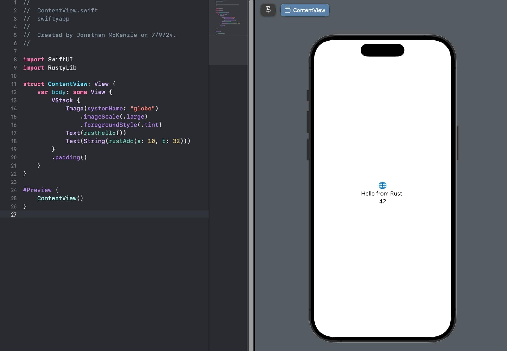

# xcode-rust-example

Demonstrates the ability to generate the necessary bindings for a rust lib compiled for an apple target to be embedded and called by a Swift project in Xcode.

## pre-reqs
1. [cargo](https://rustup.rs/)
1. xcode from [Apple app store](https://apps.apple.com/us/app/xcode/id497799835)

## Setup

`rustylib` rust library with two exposed functions  
`swiftyapp` hello world ios app that imports and uses the two rust lib functions
`swiftyrustlib` Swift package of rust lib

1. Run `make rust` (or `./build.sh`).
1. Open the Xcode project located at `swiftyapp/swiftyapp.xcodeproj`.
1. Ensure that RustyLib was successfully imported into project.
1. Build and run the project in Xcode.
1. For Intel Macs, enable and choose the **Mac Catalyst** destination in Xcode.
1. On Apple Silicon Macs, you can also choose **My Mac (Designed for iPad)** in Xcode.
1. Verify that the Rust library functions are successfully called from the Swift project.

## Make targets

- `make rust` builds the Rust static libraries, Swift bindings, and `RustyCore.xcframework`.
- `make resolve` refreshes the local Swift package reference in Xcode.
- `make app` builds the app for a generic iOS Simulator destination.
- `make catalyst` builds the app for Mac Catalyst.
- `make clean` removes Rust and Xcode derived build artifacts.

### Referenced Articles:  
- https://boehs.org/node/uniffi
- https://forgen.tech/en/blog/post/building-an-ios-app-with-rust-using-uniffi
- https://krirogn.dev/blog/integrate-rust-in-ios#make-the-library
